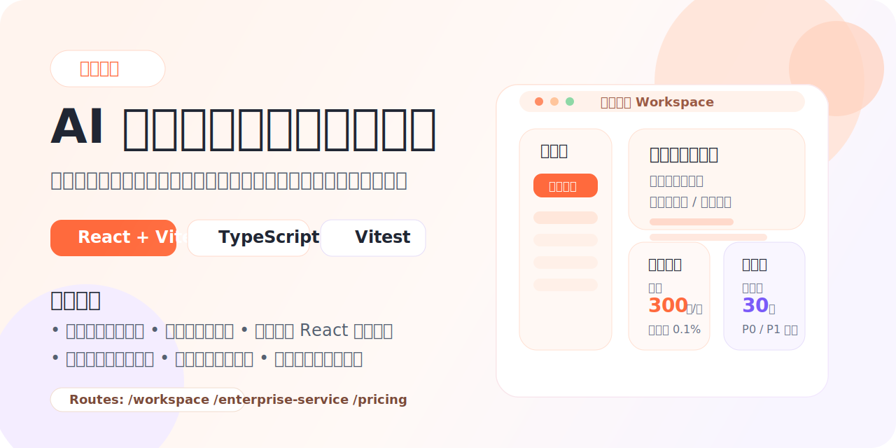

# 天外说法



一个聚焦 `AI 数字人展示`、`工作台体验复刻` 与 `业务页面品牌化改造` 的前端项目，覆盖官网落地页、工作台、企业服务页、用户访谈分析页等完整场景。

## 项目简介

`天外说法` 以真实业务页面为基础进行高保真复刻和本地化实现，目标是把 AI 数字人产品从“官网展示”延伸到“工作台操作”、“企业服务讲解”和“用户访谈成果呈现”。

项目在实现过程中统一了中文品牌表达、导航逻辑和页面风格，并结合 `React 组件化开发` 与 `静态 HTML 承接复杂页面` 两种方式，兼顾开发效率、展示还原度与后续扩展性。

## 项目亮点

- 高保真复刻：围绕目标页面进行结构、视觉与布局还原
- 品牌统一：产品名称统一为 `天外说法`，并替换品牌资源与文案
- 工作台完整：覆盖侧边栏、顶部导航、数字人库、模板区和创作入口
- 静态页承接：复杂展示页面放在 `public` 目录，以低成本保证高还原
- 数据可视化：企业服务页包含效率、获客率、质量评估等图表内容
- 访谈成果页：用户访谈全流程页面整合需求池、优先级和证据展示
- 自动校验：项目已补充 `Vitest` 测试，便于持续迭代

## 页面路由

| 路由 | 页面说明 |
| --- | --- |
| `/first` | 首页落地页，展示产品卖点、能力与品牌信息 |
| `/second` | 复刻场景页 |
| `/third` | 复刻场景页 |
| `/workspace` | AI 数字人工作台，展示创作、资产与模板入口 |
| `/enterprise-service` | 企业服务页，包含效率、成本、获客率和质量分析 |
| `/pricing` | 用户访谈全流程页，展示访谈准备、执行、需求沉淀与路线图 |
| `/features/digital-person-video.html` | 数字人视频功能介绍页 |

## 技术栈

- React 18
- Vite 6
- TypeScript
- React Router
- Vitest
- Tailwind CSS

## 目录结构

```text
.
├─ docs/
│  └─ cover.svg                  # README 封面图
├─ public/
│  ├─ enterprise-service/        # 企业服务静态页面与图表脚本
│  ├─ pricing/                   # 用户访谈全流程静态页面与素材
│  ├─ brand-icon.svg
│  └─ favicon.svg
├─ src/
│  ├─ components/                # 公共组件
│  ├─ hooks/
│  ├─ lib/
│  ├─ pages/                     # 页面与页面数据
│  ├─ test/
│  ├─ App.tsx
│  └─ index.css
├─ README.md
├─ package.json
└─ vite.config.ts
```

## 本地启动

```bash
npm install
npm run dev
```

默认访问地址：

- `http://localhost:5173/`

## 可用命令

```bash
npm run dev
npm run build
npm run test
npm run lint
npm run check
```

## 开发说明

- 主应用使用 `React + Vite + TypeScript`
- 复杂可视化页面使用 `public` 目录下的静态 HTML 承接
- 路由统一在 `src/App.tsx` 中维护
- 页面文案默认使用中文，品牌名称统一为 `天外说法`
- 工作台和首页等区域采用数据驱动方式组织内容

## 素材说明

- 仓库中的封面图位于 `docs/cover.svg`
- `public/pricing/assets/user-interview-flow.mp4` 为本地演示视频素材，已加入忽略规则，不随仓库分发
- 如果你需要完整还原 `/pricing` 页面的视频展示，可在本地自行补充同路径资源

## 适用场景

- AI 数字人产品官网展示
- 企业服务与解决方案介绍
- 工作台界面复刻与产品提案演示
- 用户访谈结果、需求池和路线图的可视化汇报

## License

仅用于项目展示与学习交流。
